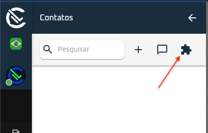

# Exemplo extensão WL.

Montamos uma pequena biblioteca javascript para facilitar a interação com nosso sistema. Ele fornece um objeto global `window.WlExtensions`, para utilizar basta importar a biblioteca no seu arquivo html.

Ex:

~~~

~~~

- Após importar podemos utilizar a função `window.WlExtensions.initilize()` para definimos botões e ações que será definida quando sua extensão for carregada no sistema;

Podemos definir botões no topo da lista de contatos, ou topo da tela atendimento.

- Lista de contatos, `contacts-list`

- Topo da tela atendimento, `attendance-view`

Ex:

~~~
  window.WlExtensions.initilize({
    buttons: {
      'contacts-list': [
          {
            text: 'Botao Alert',
            callback: () => {
              window.WlExtension.alert({
                message: 'Mensagem de sucesso',
                variant: 'success'
              });
            },
          }
        ],
        'attendance-view': [
          {
            text: 'Ver Perfil',
            callback: (atendimento) => {
              window.WlExtension.modal({
                url: `http://localhost/info-atendimento.php?atendimentoId=${atendimento.atendimentoId}`,
                title: 'Perfil',
                maxWidth: '500px',
                height: '300px'
              });
            },
          }
        ]
      }
  })
~~~

*Nos botões tipo `attendance-view` o callback retorna um objeto no primeiro argumento com atendimento em foco.*

# Funções adicionais

## Abrir modal

~~~
  window.WlExtension.modal({
    title: 'Cotações de moeda',
    url: 'https://br.widgets.investing.com/live-currency-cross-rates?theme=darkTheme', // URL da pagina para abrir iframe.
    maxWidth: '500px', // px ou %
    callback: (args)=>{
      alert('Fechou Modal');
    }
  });
~~~

## Fecha modal
ao usar funcao `.closeModal()` podemos um objeto com argumentos para recuperar no callback definido na função `.modal({})`.

~~~
 window.WlExtension.closeModal({
    name: 'teste',
    number: '659994837726'
  });
~~~

## Emitir alerta
Tipo diponiveis de alerta: ``sucess`` / ``error`` / ``warning``

~~~
 window.WlExtension.alert({
    message: 'Alert da suceso',
    variant: 'success' // success, error, warning
  });
~~~

## Abrir tela de confirmação

~~~
  window.WlExtension.confirmDialog({
    title: 'Dialog de confirmação',
    text: 'Exemplo de texto para tela de confirmação.',
    callback: (confirm) =>{
      alert('Resultado: ' + JSON.stringify(confirm));
    }
  });
~~~

## Abrir tela de confirmação

~~~
  window.WlExtension.alert({
    message: 'Alert da suceso',
    variant: 'success' // success, error, warning
  });
~~~

## Busca lista de canal disponível para usuário

~~~
  window.WlExtension.getInfoChannels()
    .then((channels) => {
      
    });
~~~

## Busca infomação do usuário logado.

Função retorna um objeto com `userId` e `systemId`.

~~~
   window.WlExtension.getInfoUser()
    .then((data) => {
      console.log(data.userId);
      console.log(data.systemKey)
    })
~~~